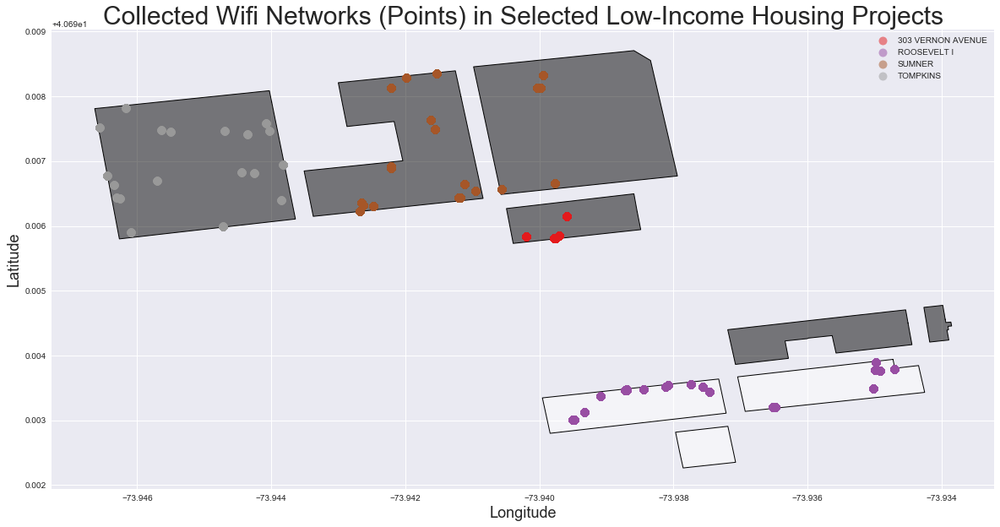

# WiFind2017
2017 Capstone Project 
Author_: Christian Rosado

Team Member, Capstone Project, Center for Urban Science and Progress, NYU  
WiFind is a framework for data collection of Wi-Fi networks and their signal strengths: 
• Currently collecting wifi data in NYC low-income housing projects  
• Analyzing data collected with other geo-located datasets to detect patterns and assess wifi accessibility 
• Researching open wifi networks and their effectiveness in closing the "digital divide" 
• Working on identifying potential clients and/or collaborators in need of wifi data 

# Collected Wifi Access Points - MAP

# Wifi Density
Wifi Density for Selected Housing Projects

|Housing Project  |    unique ssid |
|----|----|
|303 VERNON AVENUE |   113|
|ROOSEVELT I       |   283|
|SUMNER            |   334|
|TOMPKINS          |   314|

# Non-open Networks 
Median Wifi Signal Strength Levels by Selected Housing Projects

|Housing Project  |   level|
|----|----|
|303 VERNON AVENUE|   -77|
|ROOSEVELT I      |   -76|
|SUMNER           |   -76|
|TOMPKINS         |   -75|

# Open Networks 
Median Wifi Signal Strength Levels by Selected Housing Projects 
No (known) open networks found

|Housing Project  |   level|
|----|----|
|303 VERNON AVENUE|    N/A|
|ROOSEVELT I      |    N/A|
|SUMNER           |    N/A|
|TOMPKINS         |    N/A|

# Median Income in Selected Housing Projects
Most granular income dataset found was by NYC census tract 
data source: http://maps.nyc.gov/census/

|Housing Project  |   median income|
|----|----|
|303 VERNON AVENUE|    $35,339|
|ROOSEVELT I      |    $26,081|
|SUMNER           |    $21,897|
|TOMPKINS         |    $21,554|
